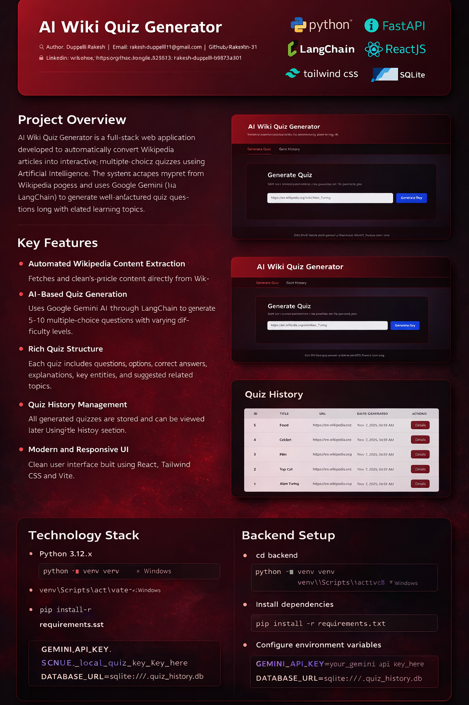
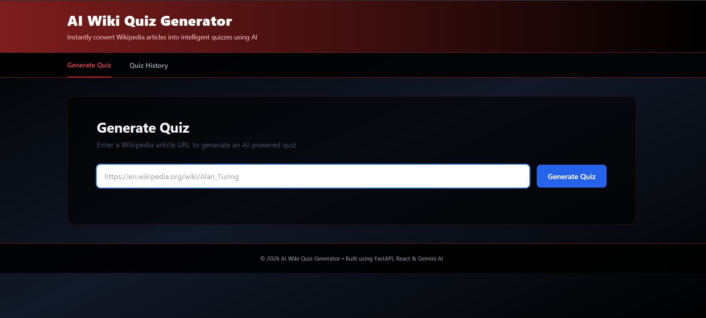

# AI Wiki Quiz Generator

**Author:** Duppelli Rakesh
**Email:** [rakeshduppelli11@gmail.com](mailto:rakeshduppelli11@gmail.com)
**GitHub:** [https://github.com/Rakeshh-31](https://github.com/Rakeshh-31)
**LinkedIn:** [https://www.linkedin.com/in/rakesh-duppelli-b9873a301](https://www.linkedin.com/in/rakesh-duppelli-b9873a301)

---

## Project Overview

AI Wiki Quiz Generator is a full‑stack web application developed to automatically convert Wikipedia articles into interactive, multiple‑choice quizzes using Artificial Intelligence. The system scrapes relevant content from Wikipedia pages and uses Google Gemini (via LangChain) to generate well‑structured quiz questions along with answers, explanations, and related learning topics.

This project was implemented end‑to‑end as part of an academic assignment to demonstrate skills in **backend development, frontend UI design, API integration, and AI‑assisted content generation**.

---
## 📸 Application Screenshots





## Key Features

* **Automated Wikipedia Content Extraction**
  Fetches and cleans article content directly from Wikipedia URLs.

* **AI‑Based Quiz Generation**
  Uses Google Gemini AI through LangChain to generate 5–10 multiple‑choice questions with varying difficulty levels.

* **Rich Quiz Structure**
  Each quiz includes questions, options, correct answers, explanations, key entities, and suggested related topics.

* **Quiz History Management**
  All generated quizzes are stored and can be viewed later using the History section.

* **Modern and Responsive UI**
  Clean user interface built using React, Tailwind CSS, and Vite.

---

## Technology Stack

### Backend

* Python 3.12.x
* FastAPI
* LangChain
* Google Gemini API
* SQLAlchemy ORM
* BeautifulSoup4
* SQLite (local development)

### Frontend

* React
* Tailwind CSS
* Vite

### Database

* SQLite (default for development)
  *(PostgreSQL or MySQL can be configured if required)*

---

## Project Structure

```
ai-wiki-quiz/
├── backend/
│   ├── database.py          # Database configuration and ORM model
│   ├── models.py            # Pydantic schemas for AI output
│   ├── scraper.py           # Wikipedia scraping logic
│   ├── llm_quiz_generator.py# LangChain + Gemini quiz generator
│   ├── main.py              # FastAPI app and API routes
│   ├── requirements.txt     # Backend dependencies
│   └── .env.example         # Environment variable template
│
├── frontend/
│   ├── src/
│   │   ├── components/      # Reusable UI components
│   │   ├── services/        # API integration logic
│   │   ├── tabs/            # Generate & History views
│   │   ├── App.jsx          # Root React component
│   │   └── index.css        # Tailwind styles
│   └── package.json
│
└── README.md
```

---

## Backend Setup

1. **Navigate to backend directory**

```bash
cd backend
```

2. **Create and activate virtual environment**

```bash
python -m venv venv
venv\Scripts\activate   # Windows
```

3. **Install dependencies**

```bash
pip install -r requirements.txt
```

4. **Configure environment variables**
   Create a `.env` file inside the `backend` folder:

```env
GEMINI_API_KEY=your_gemini_api_key_here
DATABASE_URL=sqlite:///./quiz_history.db
```

5. **Run backend server**

```bash
uvicorn main:app --reload --port 8000
```

API will be available at:

* [http://localhost:8000](http://localhost:8000)
* Swagger Docs: [http://localhost:8000/docs](http://localhost:8000/docs)

---

## Frontend Setup

1. **Navigate to frontend directory**

```bash
cd frontend
```

2. **Install dependencies**

```bash
npm install
```

3. **Start development server**

```bash
npm run dev
```

Frontend runs at:

* [http://localhost:5173](http://localhost:5173)

---

## Application Usage

1. Start backend and frontend servers
2. Open the application in a browser
3. Paste a valid Wikipedia article URL
4. Click **Generate Quiz**
5. View generated questions and explanations
6. Access previous quizzes using the **History** tab

---

## Sample Wikipedia URLs

* [https://en.wikipedia.org/wiki/Alan_Turing](https://en.wikipedia.org/wiki/Alan_Turing)
* [https://en.wikipedia.org/wiki/Artificial_intelligence](https://en.wikipedia.org/wiki/Artificial_intelligence)
* [https://en.wikipedia.org/wiki/Quantum_computing](https://en.wikipedia.org/wiki/Quantum_computing)
* [https://en.wikipedia.org/wiki/Photosynthesis](https://en.wikipedia.org/wiki/Photosynthesis)

---

## API Endpoints

* `POST /generate_quiz` → Generate quiz from Wikipedia URL
* `GET /history` → Retrieve quiz history
* `GET /quiz/{id}` → Get quiz details by ID

---

## Error Handling

The application gracefully handles:

* Invalid Wikipedia URLs
* Network or scraping failures
* AI API errors
* Database connection issues

---

## Development Notes

* Gemini model used: `gemini-2.0-flash-exp`
* Input text is limited to avoid token overflow
* Quiz difficulty levels: easy, medium, hard

---

## Author Note

This project was developed and submitted by Duppelli Rakesh as part of an internship assignment to demonstrate practical skills in full-stack web development and AI-based application design. The system showcases hands-on experience with backend APIs, frontend UI development, database integration, and the use of generative AI for real-world problem solving.
